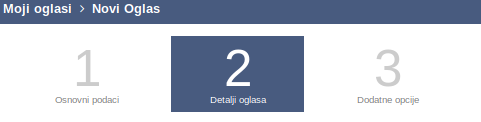
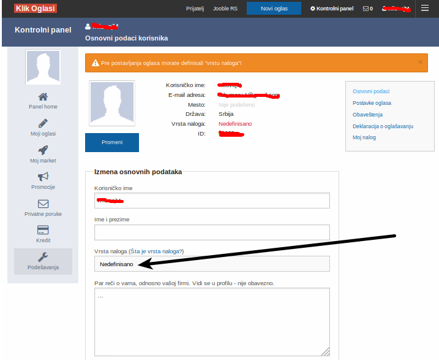

# Postavljanje oglasa

Da biste postavili oglas morate biti registrovani i ulogovani na vaš nalog.

Prođite kroz 3 koraka postavljanja oglasa i popunite podatke.

### Definisanje vrste naloga

U slučaju da vas dugme `Novi oglas`odvede na sledeću stranicu:

Potrebno je da popunite polje na slici, `Vrsta naloga`, opcije su `Osnovni - lični nalog` i `Poslovni - radnje, preduzetnici i pravna lica`.
